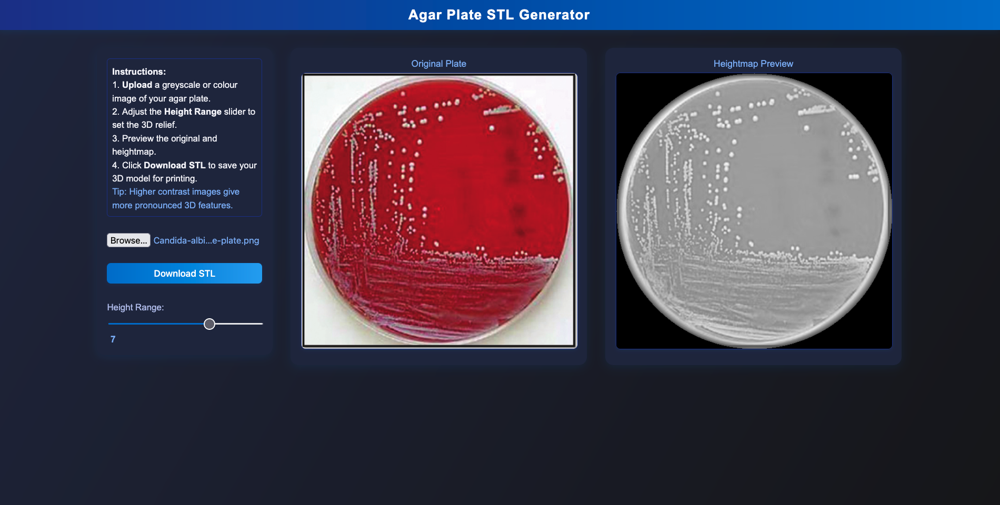

# Agar Plate STL Generator

A browser-based tool to convert agar plate images into 3D printable STL files using heightmaps.

WeblinK: https://claireprice.github.io/Agar-Plate-STL-Generator/

## Features

- Upload a colour or grayscale image of your agar plate.
- Adjust the 3D height relief dynamically.
- Preview the transformation.
- Export a printable STL file.

## How to Use

1. Open `index.html` in your browser.
2. Upload an image.
3. Use the slider to adjust height range.
4. Download your STL file for 3D printing.

## License

This work is licensed under a **Creative Commons Attribution-NonCommercial 4.0 International License**.

[View License](https://creativecommons.org/licenses/by-nc/4.0/)

You are free to share and adapt the work non-commercially, with appropriate credit.

## Screenshot

## 📖Citation

If you use this tool in a publication, please cite:

Claire L. Price (2025). Agar Plate STL Generator [Web application]. Zenodo. https://doi.org/10.xxxx/zenodo.xxxxx

DOI will be updated once published to Zenodo.

## Author

Claire L. Price  
2025

